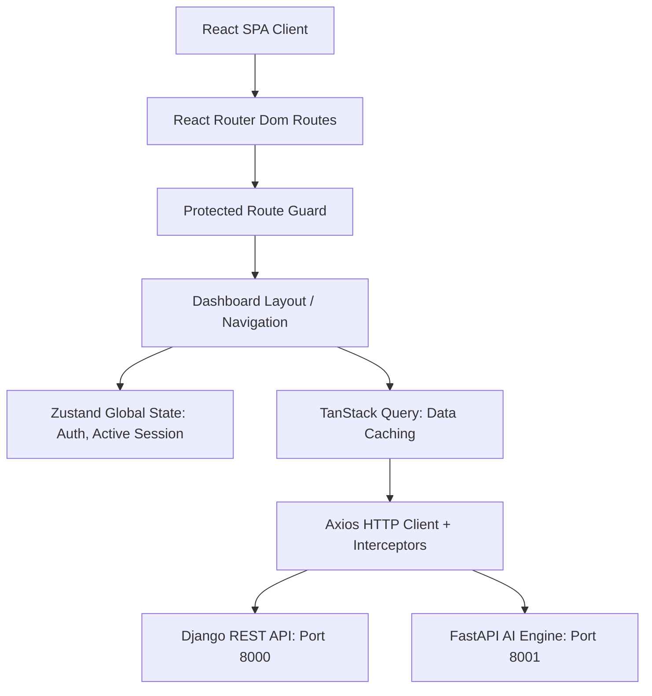

# VigilX Crime Intelligence Platform - Frontend Architecture Specification

This document serves as the official frontend specification for the VigilX Crime Intelligence Platform. It outlines the architectural design, folder structure, technology choices, API integration contracts, and UI/UX design language required to build a world-class, enterprise-grade command center interface.

---

## 1. Frontend Vision

The VigilX frontend is designed as a mission-critical **Crime Intelligence and Security Command Center Dashboard** rather than a consumer web application. Its target audience consists of law enforcement officers, crime analysts, supervisors, and federal investigators. 

To meet the high standards of professional intelligence and cyber-security tools, the visual layout, density of information, and styling will resemble:
*   **Palantir Gotham / Foundry** (Relational intelligence, object graphs, link analysis grids)
*   **IBM i2 Analyst Notebook** (Crime timeline, case networks, entity relationships)
*   **Microsoft Defender Security Center / Splunk Enterprise Security** (High-density security metrics, alert feeds, audit logs)
*   **CrowdStrike Falcon / Azure Sentinel** (Sleek dark command widgets, geographic heatmaps, critical incident notifications)

### What VigilX Is NOT:
*   **NOT a general chatbot interface** (like ChatGPT, Claude, or Gemini)
*   **NOT a consumer chat application** (like Discord, Slack, or WhatsApp)
*   **NOT a fancy consumer dashboard** (no neon cyberpunk gradients, no glowing neon text, no gaming aesthetics, no portfolio website styles)

Every page, widget, border, and interaction must convey absolute professionalism, military-grade security, readability under operational pressure, and high-performance data density.

---

## 2. Technology Stack

The application will be built using the following modern React SPA stack:

| Category | Technology Chosen | Purpose |
|---|---|---|
| **Core Framework** | React 18+ (with TypeScript) | Component-based, typed UI development |
| **Build Tool** | Vite | Ultra-fast local dev compiling and production bundling |
| **Routing** | React Router Dom v6 | Client-side routing, protected routes, and lazy loading |
| **State Management** | Zustand | Light-weight, high-performance, boilerplate-free global state |
| **Async Data / Caching** | TanStack Query v5 (React Query) | Query caching, synchronization, optimistic updates, and loading state management |
| **HTTP Client** | Axios | Request/response interceptors (automatic JWT insertion and refresh) |
| **Styling** | TailwindCSS v3 | Utility-first CSS framework for responsive utility layouts |
| **UI Components** | ShadCN UI (Radix UI primitives) | Accessible, unstyled primitives styled with Tailwind (enterprise tables, dialogs, drawers) |
| **Form Handling** | React Hook Form | High-performance, lightweight form validation and state |
| **Schema Validation** | Zod | Runtime schema validation matching form states and API contracts |
| **Animations** | Framer Motion | Fluid micro-animations (page transitions, sidebar collapses, drawer slides) |
| **Icons** | Lucide React | Clean, minimalist, and standardized vector icons |
| **Data Visualization** | Recharts | Responsive SVG charts for crime trends, timelines, and alert distributions |
| **Date Utilities** | Day.js | Lightweight alternative to Moment.js for ISO-8601 formatting and duration calculations |
| **Notifications** | React Hot Toast | Clean, non-intrusive toast notifications for alerts and system updates |

---

## 3. Folder Structure

The directory structure is organized using a **feature-based architecture** combined with shared layout, store, and theme modules. This guarantees enterprise-scale maintainability and horizontal scalability.

```text
src/
├── assets/                 # Static images, SVG files, police logos
├── components/             # Reusable UI components (buttons, badges, inputs, alerts)
│   ├── ui/                 # ShadCN UI components (imported/customized primitives)
│   └── feedback/           # Loaders, empty states, error boundaries
├── features/               # Domain-specific modules encapsulating logic, components, and types
│   ├── auth/               # Login page, auth forms, useAuth query hooks
│   ├── cases/              # Case lists, grids, creation forms, timeline modules
│   ├── victims/            # Victim tables, details, victim statements
│   ├── accused/            # Accused/suspect records, search grids, criminal history
│   ├── analytics/          # Crime trends, Recharts analytics, spatial heatmap containers
│   ├── ai/                 # Conversational AI layout, session sidebar, streaming window, evidence cards
│   └── audit/              # Audit log data grids, filter criteria
├── layouts/                # Shared layout components (DashboardLayout, AuthLayout, Sidebar)
├── hooks/                  # Global hooks (useDebounce, useLocalStorage, useKeyPress)
├── services/               # Shared logic services (date formatting, calculation utils)
├── api/                    # Axios clients, interceptors, API capability route registry
├── store/                  # Zustand stores (useAuthStore, useSessionStore)
├── routes/                 # ProtectedRoute wrapper, Routes configuration object
├── types/                  # Shared TypeScript models and API contracts
├── constants/              # System constants (routing paths, role options, lookup tables)
└── theme/                  # Tailwind theme overrides and CSS design system variables
```

---

## 4. Application Architecture



### A. SPA Client-Side Routing
Client-side routing is handled via `react-router-dom` in hash or path mode. Lazy loading (`React.lazy`) is used to split bundles by page route, ensuring fast initial page loads.

### B. Route Guard & Protected Routes
Access to intelligence pages is protected by an authorization guard (`ProtectedRoute.tsx`). If the Zustand store has no valid `accessToken`, the route guard automatically intercepts and redirects the client to `/login`.

### C. JWT Authentication & Token Refresh Flow
The authentication sequence handles access token expiration gracefully using an Axios response interceptor:
1. **Request Interceptor**: Automatically appends `Authorization: Bearer <accessToken>` to every outgoing Axios call.
2. **Response Interceptor (Token Refresh)**:
   * If an API returns `HTTP 401 Unauthorized` (indicating the short-lived access token expired), the interceptor locks outgoing requests.
   * It makes a background request to Django's `/api/auth/refresh/` using the stored `refreshToken`.
   * On success, it updates Zustand storage with the new `accessToken`, retries the failed original request, and resolves the lock.
   * On failure (refresh token also expired), it logs the user out, clears Zustand storage, and redirects to `/login`.

### D. Global State & API Caching
* Zustand handles **transient visual states** (sidebar collapse, active chatbot session ID, current authenticated officer credentials).
* TanStack Query handles **server state caching**. It prevents redundant fetches to endpoints (like accused databases or case lists) and manages invalidation (`queryClient.invalidateQueries`) after new case registrations or log updates.

---

## 5. Design Language & Design System

The system UI reflects professional governance, security operations, and analytical efficiency. 

### A. Color Palette
VigilX uses a dark, low-contrast, muted color system to prevent eye strain during long investigator shifts.

| Color Token | Hex Code | Visual Application |
|---|---|---|
| **Background Main** | `#0a0d14` | Body canvas background |
| **Card Background** | `#111622` | Dashboard panels, forms, grid containers |
| **Border Muted** | `#1c2333` | Panel separations, card borders |
| **Border Active** | `#312e81` | Focused states, input select borders |
| **Accent Primary** | `#3b82f6` | Professional Blue: Selection states, primary badges |
| **Accent Success** | `#059669` | Muted Emerald: Solved status, active officers |
| **Accent Warning** | `#d97706` | Muted Amber: Under investigation status |
| **Accent Danger** | `#b91c1c` | Dark Crimson: Pending cases, urgent system alerts |

### B. Typography
* **Primary Font**: `Outfit` or `Inter` (Sans-Serif, loaded from Google Fonts).
* **Weights**: Light (300), Regular (400), Medium (500), SemiBold (600), Bold (700).
* Monospace font styles are used for rendering reference IDs, coordinates, and raw JSON logs.

### C. Visual Rules
* **Borders**: Muted, solid borders (`1px solid #1c2333`) are preferred over drop shadows to maintain a clean grid structure.
* **Animations**: Fast, standard easing transitions (`150ms ease-in-out`) are used for collapsible components and drawer slide-ins. 
* **Glow effects**: Glowing borders or subtle glass overlays are only permitted on the **Conversational AI** layout to set it apart from standard grid forms.

---

## 6. Page Specifications

The platform is constructed of the following 17 page templates:

1.  **Login (`/login`)**: High-security gateway containing credential inputs, password visibilities, and detailed verification indicators.
2.  **Dashboard (`/`)**: Main hub providing high-level crime telemetry, alert tickers, trend panels, heatmap containers, and quick navigation grids.
3.  **Case Management (`/cases`)**: Relational list of all investigative cases. Supports multi-column sorting, advanced filter categories, and status management.
4.  **FIR Management (`/firs`)**: Dedicated portal for recording First Information Reports, dispatch times, officer assignments, and generating official prints.
5.  **Victims Portal (`/victims`)**: Grid directory listing victim profiles, ages, addresses, contact details, and their official statements linked to specific cases.
6.  **Accused/Suspects (`/accused`)**: High-security list of suspects, aliases, addresses, aliases, status markers (`SUSPECT`, `ACCUSED`, `ARRESTED`), and prior criminal histories.
7.  **Officers Registry (`/officers`)**: Public/internal registry of police personnel, designations (`Inspector`, `SHO`), assigned cases count, badge numbers, and status.
8.  **Evidence Locker (`/evidence`)**: Directory tracking physical clues, digital logs, documents, hash checks (SHA-256 for chain of custody), and storage locations.
9.  **Crime Analytics (`/analytics`)**: Core analysis screen mapping Recharts visualizations of crime distributions, solved case ratios, and monthly/weekly trends.
10. **Crime Timeline (`/timeline`)**: Gantt-style or linear timeline detailing incident timestamps, reported events, log changes, and event reference sources.
11. **Geo Intelligence (`/geo`)**: Interactive geospatial map grid utilizing Leaflet/Mapbox placeholder layers for plotting coordinates, crime density markers, and police beats.
12. **Report Generator (`/reports`)**: Action hub for generating PDF summaries, audit case files, export logs, and dispatching digital copies to command.
13. **Alert Center (`/alerts`)**: Notification grid displaying real-time system alerts (e.g. status changes, new evidence additions, unauthorized login attempts).
14. **AI Intelligence Hub (`/ai`)**: **Dedicated page** housing the multi-turn conversational interface and citation logs.
15. **System Settings (`/settings`)**: Config page for API registry mappings, LLM temperature settings, default timeout criteria, and theme adjustments.
16. **User Profile (`/profile`)**: Personalized section displaying active officer photo, badge ID, department, active session states, and credentials updating forms.
17. **Audit Logs (`/audit`)**: Security logs tracking user activity, pages accessed, timestamps, API actions, and IP addresses for platform audits.

---

## 7. Premium Dashboard Design

The dashboard (`/`) represents the high-density analytical center of VigilX, structured on a multi-column responsive grid layout:

```text
+-----------------------------------------------------------------------------+
|  [Header] National Intelligence Command             Officer: Ramesh (B-101) |
+-----------------------------------------------------------------------------+
|  [Stats Row: Total Cases (12) | Under Investigation (8) | Solved Cases (4)] |
+-----------------------------------------------------------------------------+
|  [Left: Crime Trends Chart]             | [Right: Real-time Alert Ticker]   |
|  (Interactive Area/Bar chart showing    | - Unassigned case reported (Urgent) |
|  crime categories by month)              | - Suspect John Doe added to FIR-123|
+-----------------------------------------------------------------------------+
|  [Left: Recent FIR Case Records Grid]   | [Right: Recent AI Insights Feed]  |
|  - FIR-123 | Theft | Koramangala        | "Accused John Doe shares a phone  |
|  - FIR-124 | Assault | Indiranagar      | number linked to unresolved cases"|
+-----------------------------------------------------------------------------+
```

### Key Interactive Components:
1. **Quick Action Grid**: Quick navigation button tags to record a new case, dispatch an alert, search a suspect, or open a live timeline.
2. **Case Distribution Doughnut Chart**: Interactive chart mapping proportion of crime types (Thefts vs Cybercrime vs Assaults).
3. **Heatmap Placeholder Panel**: Canvas mapping mock grids with cluster overlays representing crime concentrations.
4. **Officer Activity Queue**: List detailing the active tasks of assigned investigators.

---

## 8. Dedicated Conversational AI Portal (`/ai`)

Unlike common chatbot elements embedded in margins, the Conversational AI has a **dedicated full-page interface** located at `/ai`. This portal acts as an advanced SPA interface that doesn't trigger page reloads.

```text
+-----------------------------------------------------------------------------+
|  [Sidebar: Conversations]    |  [Main Chat Screen]                          |
|                              |  VigilX AI Assistant                         |
|  [+ New Conversation]        |  ==========================================  |
|                              |  Q: Where does he live?                      |
|  Active Session:             |  A: No. 5, 2nd Cross, Koramangala.           |
|  - Case summary John Doe     |  [Source 1: ACC_2001] [Source 2: CASE_1001]   |
|                              |  ------------------------------------------  |
|  Past Sessions:              |  [Evidence Timeline]                         |
|  - Burglary evidence         |  - john_doe (Accused): Koramangala           |
|  - Cyber fraud suspects      |  - fir_123 (Incident): Koramangala Block 4   |
|                              |  ==========================================  |
|  [Search Sessions...]        |  [Suggested Followups:                       |
|                              |   - What is John Doe's criminal history?]    |
+------------------------------+----------------------------------------------+
|                              |  [Text Input Area]                     [➔]   |
+-----------------------------------------------------------------------------+
```

### Layout Elements & State Management:
*   **Conversational History & Sidebar**: Zustand manages session items. Users can search previous chats, rename, pin, delete, or clear conversation chains dynamically.
*   **Markdown & Code Blocks**: Response bubbles format standard Markdown text and code blocks cleanly (using `react-markdown` and syntax highlighters).
*   **Evidence Cards & Citation Badges**:
    *   Citations returned from the API render as interactive badges.
    *   Clicking a badge opens an **Evidence Card** as an inline drawer or popup, parsing raw key-value snippets (such as age, gender, address, and status) into a high-density, structured profile view.
*   **Confidence & Reasoning Indicator**: Displays status bars showing the AI's confidence levels (`low`, `medium`, `high`) and a collapsed accordion detailing RAG/SQL reasoning routes.
*   **Suggested Follow-up Questions**: Dynamically render buttons representing query routes computed by the AI (e.g. `"List all evidence associated with this suspect"`).
*   **Export Actions**: Dedicated buttons to export conversational sessions into official PDF or text files.

---

## 9. Reusable Component Registry

Standardized React components styled with TailwindCSS:

1.  **Navbar**: Shared top header displaying current location, global search, alerts count, and profile dropdowns.
2.  **Sidebar**: Collapsible, responsive navigation tree linking all major pages.
3.  **Breadcrumb**: Path navigator showing current page hierarchy (`Cases > Details > Evidence`).
4.  **Header**: Section headers separating visual actions.
5.  **Card**: Container card wrapper utilizing a subtle glass effect and border highlight.
6.  **Table / DataGrid**: Responsive grid component with pagination controls, sorting tags, and row click callbacks.
7.  **Search**: Search bar component with a debounced input handler.
8.  **Filters**: Sliding panel containing checkable filters (dates, categories, status).
9.  **Dialog (Modal)**: Accessible modal popup overlay for creating records or viewing detail cards.
10. **Drawer**: Slide-out panel for checking inline records, citations, or notifications.
11. **Toast**: Muted toast feedback boxes.
12. **Loader / Skeleton**: High-density skeleton outlines showing custom loaders while fetching data.
13. **Charts**: Responsive wraps around Recharts elements (Area, Line, Bar, Pie).
14. **Chat Bubble**: Layout differentiating User message styles from Assistant bubbles.
15. **Evidence Card**: Structured detail cards displaying names, fields, status, and raw values.
16. **Timeline**: Linear event tracker showing incident points.
17. **Badge**: Small status indicators (`PENDING`, `ARRESTED`).
18. **Avatar**: Profile photo or badge symbol wrapper.
19. **Notification**: Notification bell dropdown.

---

## 10. Responsive Behaviour & Collapsible Sidebars

*   **Desktop First**: The platform is optimized for desktop layouts (police desk command centers, double monitor configurations).
*   **Tablet/Responsive Layouts**:
    *   The main navigation sidebar collapses into a thin icon-only track or hides completely behind a hamburger button.
    *   Dashboard layouts transition from a 2-column format (`dashboard-grid`) to single-column blocks.
    *   Data tables automatically support horizontal scroll or hide non-essential columns.
*   **Mobile Support**: AI chatbots and search fields scale to 100% viewport width, and secondary details open as bottom drawers instead of popups.

---

## 11. API Integration Specifications

Frontend queries map to backend services using standard Axios headers and paths.

### A. Endpoint Mappings

| Service / Action | Target Port | Path | Method | Auth Required |
|---|---|---|---|---|
| JWT Token Login | `8000` | `/api/auth/login/` | `POST` | No |
| JWT Token Refresh | `8000` | `/api/auth/refresh/` | `POST` | No |
| List Case Records | `8000` | `/api/cases/` | `GET` | Yes |
| Create Case Record | `8000` | `/api/cases/` | `POST` | Yes |
| List Accused Persons | `8000` | `/api/accused/` | `GET` | Yes |
| List Victims Profiles | `8000` | `/api/victims/` | `GET` | Yes |
| Create Investigation Log | `8000` | `/api/investigations/` | `POST` | Yes |
| Conversational AI Ask | `8001` | `/ai/ask` | `POST` | Yes |
| FastAPI System Health | `8001` | `/health` | `GET` | No |

### B. Error Handling & Retry Logic
*   **Django Gateway Timeouts**: Configure Axios timeouts at `10000ms`.
*   **TanStack Query Retries**:
    *   Read-only requests (`GET`) retry up to **2 times** with exponential backoff if a connection error occurs.
    *   Write requests (`POST`, `PUT`) never retry automatically to prevent duplicate record creations.
*   **Global Error Handling**: Unhandled API failures display a clean banner (`"Service Unavailable"`) and toast alerts with detailed code contexts.

---

## 12. UI/UX Principles

1.  **Professionalism**: Minimize gradients and rounded buttons. Keep lines clean and borders thin.
2.  **Readability**: Strict typography scales. Colors must meet WCAG AA contrast standards for dark mode readability.
3.  **Low Latency (Fast)**: Optimize bundle sizes. Use skeleton loaders to keep page transitions feeling immediate.
4.  **No Hallucination**: AI responses must highlight exactly what data is verified from the database and what remains unverified.
5.  **Information Density**: Grids, metrics, and details are compact to maximize the volume of intelligence visible on screen at once.

---

## 13. Development Roadmap

```text
Phase 1: Project Setup
  - Initialize Vite + React + TypeScript in `./`
  - Install TailwindCSS, Radix, and Lucide React
  - Configure folder structure and Tailwind theme tokens

Phase 2: Authentication Gateway
  - Setup Axios interceptors and refresh locks
  - Create the Login View, Zustand auth state, and Route Guard

Phase 3: Core Shell & Navigation
  - Construct the collapsible Sidebar, Navbar, and DashboardLayout
  - Configure React Router configurations

Phase 4: High-Density Dashboard
  - Integrate Recharts widgets (crime trends, alert ticker, quick actions)
  - Create stats counters and heatmap mock canvas

Phase 5: Case Modules (Relational Tables)
  - Integrate Case Master list and creation modals
  - Create accused and victim grids with filtering criteria

Phase 6: Dedicated Conversational AI
  - Design the `/ai` dedicated layout
  - Integrate Zustand session stores and Markdown renderers
  - Construct interactive citation cards and entity details drawers

Phase 7: Analytics & System Logs
  - Integrate analytics widgets and report exporting (PDF)
  - Create the audit logs data grid

Phase 8: Hardening & Testing
  - Perform integration checks, route checks, and responsiveness validation
```
