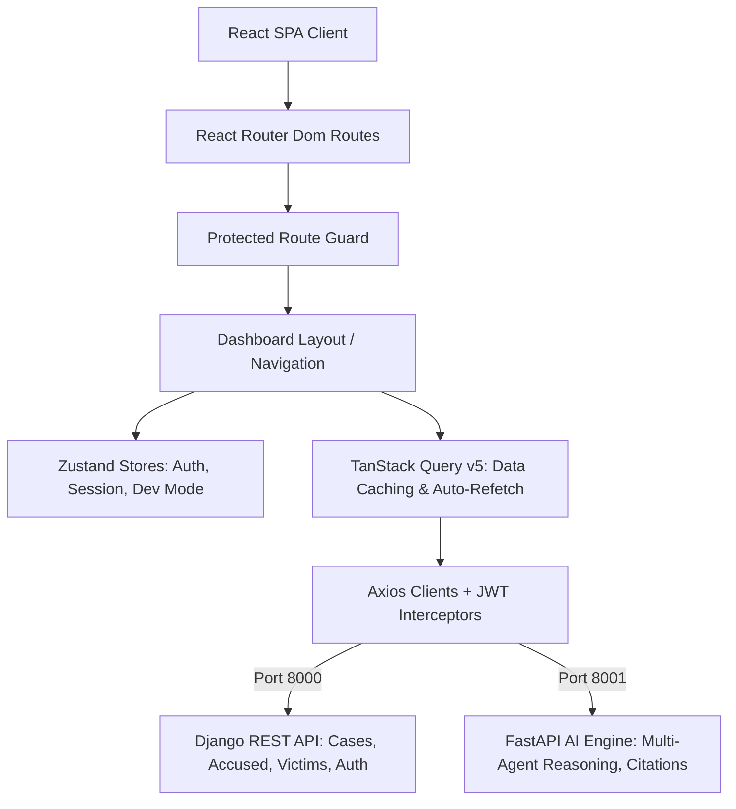

# VigilX Crime Intelligence Platform - Frontend Architecture & API Integration Specification

This document serves as the official, self-contained specification for the VigilX Crime Intelligence Platform frontend. It outlines the architectural design, folder structure, technology stack, design system, **explicit backend API integration contracts**, JSON payload schemas, Zustand stores, and TanStack Query data fetching patterns required to build and connect a mission-critical command center interface.

---

## 1. System Vision & Architecture Overview

The VigilX frontend is designed as a mission-critical **Crime Intelligence and Security Command Center Dashboard** for law enforcement officers, analysts, and investigators.



### Backend Microservices & Ports

| Service | Protocol / Base URL | Role / Purpose |
|---|---|---|
| **Django REST API** | `http://127.0.0.1:8000` | Gateway, JWT Auth, PostgreSQL/SQLite DB (Cases, Accused, Victims, Investigation Logs) |
| **FastAPI AI Engine** | `http://127.0.0.1:8001` | Agentic Orchestrator, Multi-turn RAG memory, Groq Cloud LLM (Llama-3.3-70b), Citation parsing |

---

## 2. Technology Stack & Dependencies

| Category | Technology | Purpose & Package |
|---|---|---|
| **Core Framework** | React 18+ / React 19 | Component-based SPA framework (JS/JSX or TS/TSX) |
| **Build Tool** | Vite | Compiler and development server |
| **Routing** | React Router Dom v6 / v7 | Client-side routing (`HashRouter` or `BrowserRouter`) |
| **State Management** | Zustand (`zustand`) | Lightweight global state (auth, sidebar, active chat session) |
| **Async Data Caching**| TanStack Query v5 (`@tanstack/react-query`) | Query caching, synchronization, auto-refetching |
| **HTTP Client** | Axios (`axios`) | Request/response interceptors (Bearer injection & token refresh) |
| **Styling** | TailwindCSS v3 | Utility-first CSS framework with dark theme variables |
| **UI Utilities** | `clsx` + `tailwind-merge` | Conditional class name resolution (`cn()` helper) |
| **Icons** | Lucide React (`lucide-react`) | Standardized vector icons |
| **Data Visualization**| Recharts (`recharts`) | Interactive Area, Bar, and Pie charts for crime analytics |
| **Date Formatting** | Day.js (`dayjs`) | ISO-8601 formatting and duration calculations |
| **Notifications** | React Hot Toast (`react-hot-toast`) | Security alert banners and feedback toasts |

---

## 3. Environment Configuration & Developer Mode

Create a `.env` file at the root of the frontend workspace directory:

```env
# API Base Endpoints
VITE_DJANGO_BASE_URL=http://127.0.0.1:8000
VITE_FASTAPI_BASE_URL=http://127.0.0.1:8001

# Developer Mode Flag: Set to TRUE to bypass login authentication during frontend development
VITE_DEV_MODE=TRUE
```

### Developer Mode Bypass Protocol
When `VITE_DEV_MODE=TRUE` is set:
1. `ProtectedRoute` automatically permits navigation to `/`, `/cases`, `/accused`, `/victims`, `/ai`, `/analytics`, and `/audit` without redirecting to `/login`.
2. `LoginPage` automatically initializes a mock developer session (`dev_officer`, Badge: `DEV-007`) and navigates directly to `/`.
3. `Navbar` renders fallback officer credentials if no active session is saved in `localStorage`.

---

## 4. Complete Backend API Contracts & Payload Schemas

### A. Authentication & Token Refresh (Django - Port 8000)

#### 1. Login Endpoint
* **Endpoint**: `POST http://127.0.0.1:8000/api/auth/login/`
* **Auth Required**: No
* **Request Body**:
```json
{
  "username": "officer1",
  "password": "Officer123!"
}
```
* **Success Response (`200 OK`)**:
```json
{
  "refresh": "eyJhbGciOiJIUzI1NiIsIn...",
  "access": "eyJhbGciOiJIUzI1NiIsIn..."
}
```

#### 2. Token Refresh Endpoint
* **Endpoint**: `POST http://127.0.0.1:8000/api/auth/refresh/`
* **Auth Required**: No
* **Request Body**:
```json
{
  "refresh": "<refresh_token_string>"
}
```
* **Success Response (`200 OK`)**:
```json
{
  "access": "<new_access_token_string>"
}
```

---

### B. FIR Case Records API (Django - Port 8000)

#### 1. List Cases
* **Endpoint**: `GET http://127.0.0.1:8000/api/cases/`
* **Query Parameters**: `?search=FIR-123` (optional keyword search for FIR number or description)
* **Auth Required**: Yes (`Authorization: Bearer <access_token>`)
* **Success Response (`200 OK`)**:
```json
{
  "count": 12,
  "next": null,
  "previous": null,
  "results": [
    {
      "id": "b20363f3-6346-4c04-a358-9dfa2614f68b",
      "fir_number": "FIR-123",
      "crime_type": "THEFT",
      "incident_date_time": "2026-07-14T10:00:00Z",
      "reported_date_time": "2026-07-14T11:30:00Z",
      "location": "Koramangala, Bengaluru",
      "latitude": 12.9352,
      "longitude": 77.6245,
      "status": "PENDING",
      "description": "Larceny reported at electronic retail store."
    }
  ]
}
```

#### 2. Create Case Record
* **Endpoint**: `POST http://127.0.0.1:8000/api/cases/`
* **Auth Required**: Yes
* **Request Body**:
```json
{
  "fir_number": "FIR-456",
  "crime_type": "BURGLARY",
  "incident_date_time": "2026-07-14T10:00:00Z",
  "reported_date_time": "2026-07-14T11:30:00Z",
  "location": "Indiranagar, Bengaluru",
  "latitude": 12.9716,
  "longitude": 77.6412,
  "status": "PENDING",
  "description": "Burglary reported at warehouse."
}
```

---

### C. Accused / Suspects Records API (Django - Port 8000)

#### 1. List Accused Persons
* **Endpoint**: `GET http://127.0.0.1:8000/api/accused/`
* **Query Parameters**: `?fir=<fir_uuid>` (optional filter by case ID)
* **Auth Required**: Yes
* **Success Response (`200 OK`)**:
```json
{
  "count": 5,
  "next": null,
  "previous": null,
  "results": [
    {
      "id": "c30474f4-7457-5d05-b459-0efb3725f79c",
      "name": "John Doe",
      "alias": "Johnny",
      "age": 34,
      "gender": "MALE",
      "address": "No. 5, 2nd Cross, Koramangala, Bengaluru",
      "status": "ACCUSED",
      "prior_convictions_count": 2,
      "fir": "b20363f3-6346-4c04-a358-9dfa2614f68b"
    }
  ]
}
```

---

### D. Victims Profiles API (Django - Port 8000)

#### 1. List Victims Profiles
* **Endpoint**: `GET http://127.0.0.1:8000/api/victims/`
* **Query Parameters**: `?fir=<fir_uuid>` (optional filter)
* **Auth Required**: Yes
* **Success Response (`200 OK`)**:
```json
{
  "count": 4,
  "next": null,
  "previous": null,
  "results": [
    {
      "id": "d40585f5-8568-6e06-c560-1fgc4836g80d",
      "name": "Jane Smith",
      "age": 29,
      "contact_number": "+91-9876543210",
      "statement": "Observed suspect fleeing location at 10:15 AM.",
      "fir": "b20363f3-6346-4c04-a358-9dfa2614f68b"
    }
  ]
}
```

---

### E. Investigation Diary Logs API (Django - Port 8000)

#### 1. Add Log Entry
* **Endpoint**: `POST http://127.0.0.1:8000/api/investigations/`
* **Auth Required**: Yes
* **Request Body**:
```json
{
  "fir": "b20363f3-6346-4c04-a358-9dfa2614f68b",
  "activity_summary": "Searched suspect's prior residence.",
  "activity_details": "No physical clues retrieved at Indiranagar house.",
  "date_time": "2026-07-14T14:00:00Z"
}
```

---

### F. Agentic Conversational AI API (FastAPI - Port 8001)

#### 1. Ask AI Assistant
* **Endpoint**: `POST http://127.0.0.1:8001/ai/ask`
* **Headers**: `Authorization: Bearer <access_token>`, `Content-Type: application/json`
* **Request Body**:
```json
{
  "session_id": "chatbot-session-101",
  "user_id": "officer-john-1",
  "question": "Where does John Doe live?"
}
```
* **Success Response (`200 OK`)**:
```json
{
  "success": true,
  "message": "ok",
  "data": {
    "answer": "John Doe lives at No. 5, 2nd Cross, Koramangala.",
    "intent": "suspect_query",
    "summary": "user: Where does John Doe live?",
    "case_summary": null,
    "evidence_used": 2
  },
  "metadata": {
    "intent": "suspect_query",
    "evidence_sources": 2,
    "api_records": 1,
    "langgraph_enabled": true,
    "confidence": "high",
    "evidence_threshold_met": true,
    "rag_citations": 1,
    "sql_citations": 1,
    "evidence_source_breakdown": {
      "accused_records": 1,
      "django_api": 1
    }
  },
  "citations": [
    {
      "source": "accused_records",
      "reference_id": "b20363f3-6346-4c04-a358-9dfa2614f68b",
      "snippet": "id=b20363f3-6346-4c04-a358-9dfa2614f68b; name=John Doe; address=No. 5, 2nd Cross, Koramangala; status=ACCUSED",
      "score": null
    }
  ],
  "errors": null
}
```

#### 2. System Health Check
* **Endpoint**: `GET http://127.0.0.1:8001/health`
* **Auth Required**: No
* **Success Response (`200 OK`)**:
```json
{
  "status": "ok",
  "timestamp": "2026-07-21T12:00:00Z"
}
```

---

## 5. Frontend Axios Client & Auth Store Implementation

### A. Axios Client with Auto-Refresh Interceptor (`src/api/client.js` or `src/api/client.ts`)

```javascript
import axios from 'axios'
import { useAuthStore } from '../store/useAuthStore'

export const DJANGO_BASE_URL = import.meta.env.VITE_DJANGO_BASE_URL || 'http://127.0.0.1:8000'
export const FASTAPI_BASE_URL = import.meta.env.VITE_FASTAPI_BASE_URL || 'http://127.0.0.1:8001'

export const apiClient = axios.create({
  baseURL: DJANGO_BASE_URL,
  timeout: 10000,
  headers: { 'Content-Type': 'application/json' },
})

export const aiClient = axios.create({
  baseURL: FASTAPI_BASE_URL,
  timeout: 15000,
  headers: { 'Content-Type': 'application/json' },
})

const addAuthToken = (config) => {
  const token = useAuthStore.getState().accessToken
  if (token && config.headers) {
    config.headers.Authorization = `Bearer ${token}`
  }
  return config
}

apiClient.interceptors.request.use(addAuthToken, (error) => Promise.reject(error))
aiClient.interceptors.request.use(addAuthToken, (error) => Promise.reject(error))

let isRefreshing = false
let refreshSubscribers = []

const subscribeTokenRefresh = (cb) => { refreshSubscribers.push(cb) }
const onRefreshed = (token) => {
  refreshSubscribers.forEach((cb) => cb(token))
  refreshSubscribers = []
}

const handleTokenRefresh = async (error, clientInstance) => {
  const { config, response } = error
  const originalRequest = config

  if (response && response.status === 401 && !originalRequest._retry) {
    if (originalRequest.url?.includes('/api/auth/login/') || originalRequest.url?.includes('/api/auth/refresh/')) {
      return Promise.reject(error)
    }

    if (isRefreshing) {
      return new Promise((resolve) => {
        subscribeTokenRefresh((token) => {
          originalRequest.headers.Authorization = `Bearer ${token}`
          resolve(clientInstance(originalRequest))
        })
      })
    }

    originalRequest._retry = true
    isRefreshing = true

    const refreshToken = useAuthStore.getState().refreshToken
    if (!refreshToken) {
      useAuthStore.getState().logout()
      return Promise.reject(error)
    }

    try {
      const res = await axios.post(`${DJANGO_BASE_URL}/api/auth/refresh/`, { refresh: refreshToken })
      const newAccessToken = res.data.access
      const newRefreshToken = res.data.refresh || refreshToken

      useAuthStore.getState().setTokens({ access: newAccessToken, refresh: newRefreshToken })
      onRefreshed(newAccessToken)
      isRefreshing = false

      originalRequest.headers.Authorization = `Bearer ${newAccessToken}`
      return clientInstance(originalRequest)
    } catch (refreshError) {
      isRefreshing = false
      refreshSubscribers = []
      useAuthStore.getState().logout()
      return Promise.reject(refreshError)
    }
  }

  return Promise.reject(error)
}

apiClient.interceptors.response.use((r) => r, (e) => handleTokenRefresh(e, apiClient))
aiClient.interceptors.response.use((r) => r, (e) => handleTokenRefresh(e, aiClient))
```

---

## 6. TanStack Query Custom Hooks for Component Integration

Use these hooks inside React components to connect UI elements directly to live backend services with automated caching and loading states:

### A. Case Records Hook (`src/hooks/useCases.js`)

```javascript
import { useQuery, useMutation, useQueryClient } from '@tanstack/react-query'
import { apiClient } from '../api/client'

export const useCases = (searchQuery = '') => {
  return useQuery({
    queryKey: ['cases', searchQuery],
    queryFn: async () => {
      const response = await apiClient.get('/api/cases/', {
        params: searchQuery ? { search: searchQuery } : {},
      })
      return response.data.results || response.data
    },
    staleTime: 1000 * 30, // 30s cache
  })
}

export const useCreateCase = () => {
  const queryClient = useQueryClient()
  return useMutation({
    mutationFn: async (newCaseData) => {
      const response = await apiClient.post('/api/cases/', newCaseData)
      return response.data
    },
    onSuccess: () => {
      queryClient.invalidateQueries({ queryKey: ['cases'] })
    },
  })
}
```

### B. Accused Records Hook (`src/hooks/useAccused.js`)

```javascript
import { useQuery } from '@tanstack/react-query'
import { apiClient } from '../api/client'

export const useAccused = (firId = '') => {
  return useQuery({
    queryKey: ['accused', firId],
    queryFn: async () => {
      const response = await apiClient.get('/api/accused/', {
        params: firId ? { fir: firId } : {},
      })
      return response.data.results || response.data
    },
  })
}
```

### C. Conversational AI Ask Hook (`src/hooks/useAskAI.js`)

```javascript
import { useMutation } from '@tanstack/react-query'
import { aiClient } from '../api/client'

export const useAskAI = () => {
  return useMutation({
    mutationFn: async ({ sessionId, question, userId = 'officer-1' }) => {
      const response = await aiClient.post('/ai/ask', {
        session_id: sessionId,
        user_id: userId,
        question,
      })
      return response.data
    },
  })
}
```

---

## 7. Folder Structure Blueprint

```text
src/
├── api/
│   └── client.js (or client.ts)          # Axios instances for Django & FastAPI
├── assets/                                # Icons and logos
├── components/
│   ├── feedback/                         # Loaders, skeleton screens, error fallback
│   └── ui/                               # Shared badges, buttons, cards, drawers
├── features/
│   ├── accused/pages/AccusedPage.jsx      # Suspect directory data grid
│   ├── ai/pages/AIChatPage.jsx           # Dedicated multi-turn AI chat portal
│   ├── analytics/pages/AnalyticsPage.jsx # Crime trend charts & visualizations
│   ├── audit/pages/AuditPage.jsx         # Security log grids
│   ├── auth/pages/LoginPage.jsx          # Security gateway login screen
│   ├── cases/pages/CasesPage.jsx         # Case file manager
│   ├── dashboard/pages/DashboardPage.jsx # Main command telemetry hub
│   └── victims/pages/VictimsPage.jsx     # Victims directory
├── hooks/
│   ├── useCases.js                       # TanStack query hook for FIR cases
│   ├── useAccused.js                     # TanStack query hook for suspect records
│   └── useAskAI.js                       # TanStack mutation hook for FastAPI AI engine
├── layouts/
│   ├── DashboardLayout.jsx               # Master layout with sidebar & header
│   ├── Navbar.jsx                        # Top bar with officer profile & health states
│   └── Sidebar.jsx                       # Collapsible navigation menu
├── routes/
│   ├── ProtectedRoute.jsx                # Authorization route guard (with DEV_MODE bypass)
│   └── index.jsx                         # React Router HashRouter mapping
├── store/
│   ├── useAuthStore.js                   # Zustand auth token & user state
│   └── useSessionStore.js                # Zustand sidebar collapse & chat session state
├── index.css                             # Tailwind directives & CSS custom properties
└── main.jsx                              # Application entrypoint
```

---

## 8. Theme Palette & CSS Custom Variables

Inject the following design system variables into `src/index.css`:

```css
@import url('https://fonts.googleapis.com/css2?family=Outfit:wght@300;400;500;600;700&family=JetBrains+Mono:wght@400;500&display=swap');

@tailwind base;
@tailwind components;
@tailwind utilities;

@layer base {
  :root {
    --background: 222 38% 6%;    /* #0a0d14 */
    --foreground: 210 40% 98%;
    --card: 222 33% 10%;          /* #111622 */
    --card-foreground: 210 40% 98%;
    --primary: 217 91% 60%;       /* #3b82f6 - Professional Blue */
    --secondary: 222 29% 16%;     /* #1c2333 - Muted Border */
    --destructive: 0 74% 42%;     /* #b91c1c - Alert Danger */
    --border: 222 29% 16%;
    --ring: 242 47% 34%;          /* #312e81 - Active Focus */
    --radius: 0.25rem;
  }
}

body {
  @apply bg-background text-foreground;
  font-family: 'Outfit', sans-serif;
}

code, pre {
  font-family: 'JetBrains Mono', monospace;
}
```

---

## 9. Quickstart Instructions for Frontend Implementation

1. **Copy this file** (`FRONTEND_ARCHITECTURE.md`) into your frontend project root directory.
2. **Install core dependencies**:
   ```bash
   npm install react-router-dom zustand @tanstack/react-query axios lucide-react recharts dayjs react-hot-toast react-hook-form zod framer-motion clsx tailwind-merge react-is
   npm install -D tailwindcss@3 postcss autoprefixer vite @vitejs/plugin-react
   ```
3. **Set up `.env`**:
   Set `VITE_DEV_MODE=TRUE` to run in bypass mode, or `VITE_DEV_MODE=FALSE` to test real JWT authentication against Django at `127.0.0.1:8000`.
4. **Start Dev Server**:
   ```bash
   npm run dev
   ```
