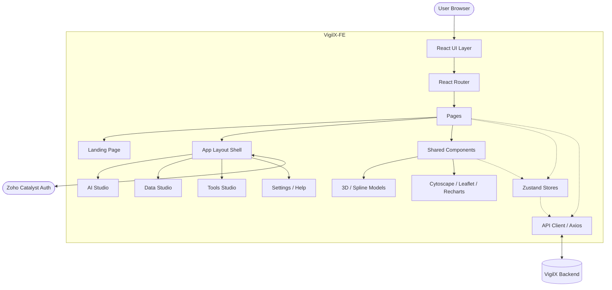

# VigilX Frontend (VigilX-FE)

VigilX is an advanced investigation, analytics, and AI orchestration platform. This repository contains the frontend client, built with modern web technologies, focusing on a highly interactive, 3D-accelerated, and data-rich user experience.

## Tech Stack & Core Libraries

- **Framework**: React 19 + Vite
- **Routing**: React Router v7
- **State Management**: Zustand
- **Styling**: Tailwind CSS v4, Framer Motion (for animations)
- **Authentication**: Zoho Catalyst Auth Client
- **Data Visualization & GIS**: 
  - `cytoscape` & `react-cytoscapejs` for network graphs
  - `leaflet` & `react-leaflet` for mapping
  - `maplibre-gl` for advanced WebGL maps
  - `recharts` for charts and analytics
- **3D Graphics**: `three.js`, `@react-three/fiber`, `@react-three/drei`, and `@splinetool/react-spline` for immersive 3D landing pages and components.

## Architecture

The frontend follows a modular architecture separating presentation, state, routing, and api communication.

### High-Level Diagram



### Directory Structure

```text
src/
├── api/          # Axios instances and API request functions
├── components/   # Reusable UI components
│   ├── auth/     # Authentication components & ProtectedRoutes
│   ├── landing/  # Landing page specific components
│   ├── layout/   # Sidebar, Topbar, App Shell
│   └── three/    # 3D models and React Three Fiber components
├── pages/        # Route-level components
│   ├── AIStudio/         # Multi-Agent, Conversation AI, ML Studio
│   ├── Auth/             # Login / Signup flows
│   ├── DataStudio/       # Connectors, ETL Pipelines, DB Chatbot
│   ├── Home/             # Dashboard Home
│   ├── Landing.jsx       # 3D Immersive Landing Page
│   └── ToolsStudio/      # Investigation Hub, GIS, Profiling, Finance
├── store/        # Zustand state management stores
├── App.jsx       # Main application component & routing setup
├── index.css     # Global Tailwind styles
└── main.jsx      # Entry point
```

## Key Modules

1. **AI Studio**: An orchestration suite for coordinating AI agents, viewing the agent fleet (DAG execution pipelines), and managing standard conversational AI interfaces.
2. **Data Studio**: Used for setting up DB connectors, configuring ETL pipelines, and chatting directly with connected databases.
3. **Tools Studio (Investigation Hub)**: Houses advanced analytics, GIS mapping, suspect profiling, and financial tracing tools using Cytoscape and MapLibre.
4. **Auth & Protection**: Utilizes `@zcatalyst/auth-client` integrated with a `ProtectedRoute` wrapper to ensure the app dashboard is secure.
5. **Immersive UI**: Leverages Framer Motion for page transitions and Spline/Three.js for a premium, hardware-accelerated aesthetic.

## Getting Started

1. **Install dependencies:**
   ```bash
   npm install
   ```

2. **Set up Environment Variables:**
   Ensure you have a `.env` file configured with your Zoho Catalyst credentials and backend API URL.

3. **Run the development server:**
   ```bash
   npm run dev
   ```
   The app will typically be available at `http://localhost:5173`.
